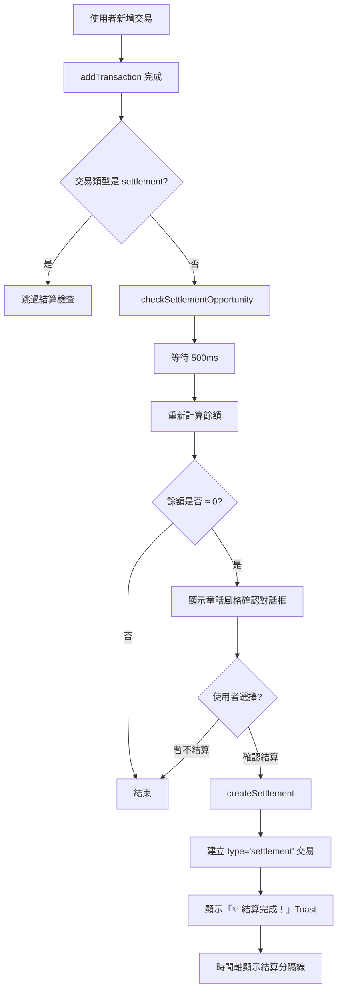

## [5.12.0] - 2026-01-10

### ✨ 通知中心篩選功能（已讀/未讀切換）

**新增童話風格的 Segmented Control，優化通知瀏覽體驗**

#### 核心功能

1. **智能篩選邏輯** ([NotificationPanel.js:17](js/components/NotificationPanel.js#L17), [NotificationPanel.js:142-182](js/components/NotificationPanel.js#L142-L182))
   - 📬 預設顯示「未讀」通知（避免一打開就看到已讀通知）
   - 📋 可切換到「全部」查看所有通知
   - 🔄 切換時自動重置分頁計數
   - 🎯 篩選狀態與 UI 完全同步

2. **童話風格 Segmented Control** ([notifications.css:85-163](css/components/notifications.css#L85-L163))
   - 🎨 馬卡龍粉色漸層（`#FFB7B2` → `#FF9EAA`）
   - 🍮 果凍彈跳動畫（jellyBounce）
   - ✨ 圖標放大 + 陰影效果
   - 💫 流暢的 0.25s cubic-bezier 過渡

3. **智能空狀態訊息** ([NotificationPanel.js:200-214](js/components/NotificationPanel.js#L200-L214))
   - 未讀篩選：「太棒了！你已經看完所有通知了 🎉」
   - 全部篩選：「當對方修改記帳時會顯示在這裡喔」

#### 技術實作

4. **狀態管理** ([NotificationPanel.js:17](js/components/NotificationPanel.js#L17))
   ```javascript
   this.currentFilter = 'unread'; // 'unread' | 'all'
   ```

5. **篩選方法**
   - `setFilter(filter)` - 切換篩選狀態
   - `getFilteredActivities()` - 取得過濾後的活動列表
   - `updateFilterButtons()` - 更新按鈕 active 狀態

6. **HTML 結構** ([index.html:988-997](index.html#L988-L997))
   ```html
   <div class="notification-filter">
       <button data-filter="unread">📬 未讀</button>
       <button data-filter="all">📋 全部</button>
   </div>
   ```

#### 使用者體驗提升

- ✅ 預設只顯示未讀通知，避免視覺干擾
- ✅ 可愛的果凍彈跳動畫，增加互動樂趣
- ✅ 篩選後的分頁載入正常運作
- ✅ 友善的空狀態提示訊息

---

## [5.11.0] - 2026-01-09

### ✨ 時間軸對話框 UI/UX 大優化（LINE 風格）

**重新設計交易卡片顯示，更簡潔、更直觀、更可愛**

#### 核心改進

1. **對話框內容簡化** ([TransactionRenderer.js:125-237](js/components/TransactionRenderer.js#L125-L237))
   - 📝 只顯示「名稱 + 金額」
   - 📏 名稱最大寬度 140px，金額固定寬度 75px
   - ✂️ 超出長度自動截斷（truncate），避免互相擠壓

2. **小圓球浮出設計（像 LINE 表情符號）** ([transaction-list.css:289-345](css/components/transaction-list.css#L289-L345))
   - 🎈 付款標籤小圓球：浮在對話框上方（一半在內一半在外）
   - 📸 照片小圓球：浮在對話框下方（一半在內一半在外）
   - 🎯 使用 `position: absolute` + 負偏移實現浮出效果
   - 🔆 白色邊框 + 陰影增強立體感

3. **顏色語意系統**
   - 🩷 **粉色對話框**：幫寶付（beneficiary = baobao）
   - 💙 **藍色對話框**：幫步付（beneficiary = bubu）
   - 💚 **綠色對話框**：幫共付（beneficiary = both）
   - 📍 **左右位置**：區別誰付款（寶付靠左、步付靠右）

4. **小圓球位置邏輯**
   - 寶付（靠左）：
     - 付款標籤在「左上角」
     - 照片徽章在「右下角」
   - 步付（靠右）：
     - 付款標籤在「右上角」
     - 照片徽章在「左下角」

5. **修復顯示問題** ([transaction-list.css:237-253](css/components/transaction-list.css#L237-L253))
   - 🔧 `.date-transactions-wrapper` 改為 `overflow: visible`
   - 📐 新增 `padding-top: 16px` 確保第一筆交易的小圓球不被遮住
   - 🎬 收合時移除上方空間，保持動畫流暢

#### 使用者體驗提升

- ✅ 資訊層次更清晰（位置 = 誰付、顏色 = 幫誰）
- ✅ 對話框更簡潔（移除冗餘標籤）
- ✅ 小圓球更生動（浮出效果像 LINE）
- ✅ 手機友善（75% 寬度，適合小螢幕）

---

## [5.10.0] - 2026-01-09

### ✨ 自動結算功能（餘額歸零智能提示）

**新增交易後自動偵測餘額歸零，彈出童話風格結算確認**

#### 核心功能

1. **智能結算偵測** ([data.js:755-784](js/data.js#L755-L784))
   - 🎯 新增交易完成後自動檢查餘額狀態
   - 💰 偵測餘額歸零（容許 ±0.01 誤差）
   - ⏱️ 等待 500ms 確保餘額已更新
   - 🔄 僅在一般交易後檢查，結算交易本身不觸發

2. **童話風格確認對話框** ([data.js:786-855](js/data.js#L786-L855))
   ```javascript
   async _showSettlementConfirmation(date) {
       // 建立 Promise 包裝的對話框
       // 使用漸層背景、圓潤邊角、閃亮圖示
       // 提供「暫不結算」和「確認結算 ✨」兩個選項
   }
   ```
   - 🎨 漸層粉紫背景 + 圓潤邊角
   - ✨ 閃亮圖示動畫（bounceSlow）
   - 📅 明確顯示結算日期
   - 🖱️ 支援點擊背景關閉
   - 🎭 Promise 包裝，async/await 流程

3. **自動建立結算交易** ([data.js:857-899](js/data.js#L857-L899))
   ```javascript
   async createSettlement(date = null) {
       // 建立 type='settlement' 的特殊交易
       // 金額為 0，不影響餘額
       // 自動顯示成功提示
   }
   ```
   - 📝 交易類型：`type: 'settlement'`
   - 💵 金額：`0`（不影響餘額）
   - 🏷️ 分類：`['結算']`
   - 🎉 成功後顯示「✨ 結算完成！」Toast

#### 動畫系統升級

4. **新增結算專用動畫** ([animations.css:167-200](css/animations/animations.css#L167-L200))

   **scaleIn（放大彈入）**
   ```css
   @keyframes scaleIn {
       0%   { opacity: 0; transform: scale(0.8); }
       50%  { opacity: 1; transform: scale(1.05); }
       100% { opacity: 1; transform: scale(1); }
   }
   ```
   - 時長：0.4 秒
   - 曲線：`cubic-bezier(0.4, 0, 0.2, 1)` → easeInOut
   - 淡入 + 彈性放大

   **bounceSlow（慢速彈跳）**
   ```css
   @keyframes bounceSlow {
       0%, 100% { transform: translateY(0); }
       50%      { transform: translateY(-10px); }
   }
   ```
   - 時長：2 秒無限循環
   - 曲線：`ease-in-out`
   - 用於閃亮圖示 ✨

5. **Utility Classes**
   ```css
   .animate-scale-in    { animation: scaleIn 0.4s cubic-bezier(0.4, 0, 0.2, 1); }
   .animate-bounce-slow { animation: bounceSlow 2s ease-in-out infinite; }
   ```

#### 整合邏輯流程



#### 時間軸視覺化

6. **結算分隔線自動渲染**（已在 v5.9.0 實作）
   - 📍 利用 [SettlementDetector.js](js/utils/SettlementDetector.js) 偵測 `type='settlement'`
   - 🎨 [TimelineView.js](js/components/TimelineView.js) 自動渲染分隔線
   - ✨ 使用 [transaction-list.css](css/components/transaction-list.css) 閃亮動畫樣式
   - 📏 「結清於 XX月XX日」標籤 + 雙線條

#### 技術亮點

7. **並發安全設計**
   - 使用 `_pendingOperations` Set 防止重複操作
   - 結算交易透過 `type` 欄位區分，避免無限迴圈
   - 錯誤捕獲不影響主流程

8. **用戶體驗優化**
   - ⏱️ 等待餘額更新（500ms）避免時序問題
   - 🎨 童話風格一致性（粉紫漸層、圓潤邊角）
   - 📱 手機友善（大按鈕、清晰文字）
   - 🔔 Toast 提示即時反饋

#### 修改檔案

- [data.js](js/data.js)
  - 新增 `_checkSettlementOpportunity()` 方法
  - 新增 `_showSettlementConfirmation()` 方法
  - 新增 `createSettlement()` 方法
  - 修改 `addTransaction()` 添加結算檢查邏輯
- [animations.css](css/animations/animations.css)
  - 新增 `scaleIn` 關鍵幀動畫
  - 新增 `bounceSlow` 關鍵幀動畫
  - 新增 `.animate-scale-in` 和 `.animate-bounce-slow` utility classes

#### 下一步計劃

- [ ] 在分析頁面顯示結算歷史統計
- [ ] 支援手動觸發結算（不等餘額歸零）
- [ ] 結算記錄支援備註功能
- [ ] 匯出結算報表（PDF/CSV）

---

## [5.9.0] - 2026-01-09

### ✨ 表單拖曳交互與動畫系統大升級

**全新的表單拖曳關閉功能 + 絲滑流暢的動畫體驗**

#### 新增功能

1. **拖曳關閉功能** ([TransactionForm.js:27-151](js/components/TransactionForm.js#L27-L151))
   - 🎯 可拖曳灰色橫條上下移動表單
   - 📏 向下拖曳超過 30% 螢幕高度自動關閉
   - 🔙 未達閾值時自動回彈（彈簧效果）
   - 🎨 向上拖曳有阻力效果（20% 移動比例）
   - 🌫️ 拖曳時背景透明度動態變化

2. **觸控事件處理**
   - `touchstart`：記錄起始位置，停用 CSS transition
   - `touchmove`：即時更新表單位置和背景透明度
   - `touchend`：判斷是否達到關閉閾值
   - `touchcancel`：處理意外中斷

3. **動畫狀態管理**
   - `opening`：開啟時播放一次，動畫結束後自動移除
   - `closing`：下滑關閉動畫
   - `snapping-back`：回彈彈簧動畫
   - 解決了拖曳後重複播放開啟/關閉動畫的問題

#### 動畫系統優化

4. **更流暢的動畫曲線** ([animations.css:94-154](css/animations/animations.css#L94-L154))

   **滑上來動畫（slideUpBounce）**
   - 時長：0.8 秒（原 1 秒）
   - 曲線：`cubic-bezier(0.16, 1, 0.3, 1)` → easeOutExpo
   - 關鍵幀：0% → 45% → 65% → 80% → 100%（更細緻）
   - 新增淡入效果（opacity 0 → 1）
   - 減少超調幅度（10% → 2%）

   **下滑關閉動畫（slideDownOut）**
   - 時長：0.6 秒（原 1 秒）
   - 曲線：`cubic-bezier(0.32, 0, 0.67, 0)` → 快速加速
   - 在 20% 就開始淡出，視覺上更快

   **回彈動畫（snapBackBounce）**
   - 時長：0.8 秒（原 1.5 秒）
   - 曲線：`cubic-bezier(0.16, 1, 0.3, 1)` → easeOutExpo
   - 7 個關鍵幀（原 4 個）：0% → 30% → 50% → 65% → 78% → 90% → 100%
   - 逐漸衰減的振幅：8px → 3px → 1.5px → 0.5px
   - 使用 CSS `calc()` 動態計算起始位置

5. **CSS 架構改進** ([bottom-sheet.css:26-58](css/components/bottom-sheet.css#L26-L58))
   - 移除預設 `animation` 屬性，避免重複播放
   - 新增 `.opening`、`.closing`、`.snapping-back` 獨立類別
   - 添加 `will-change: transform` 優化性能
   - 添加 `transition: none` 確保拖曳時即時響應

#### 技術細節

6. **CSS 變數傳遞**
   ```javascript
   // JavaScript 設定拖曳位置
   this.sheetContent.style.setProperty('--drag-y', `${deltaY}px`);

   // CSS 動態計算起始位置
   transform: translateX(-50%) translateY(calc(var(--drag-y, 0) * 0.3 - 12px));
   ```

7. **表單底部對齊優化**
   - 添加 `viewport-fit=cover` 支援全螢幕
   - 使用 `env(safe-area-inset-bottom)` 適配手機底部安全區域
   - 改用 `position: fixed` 確保相對於視口定位

#### 動畫時長對比

| 動畫 | 優化前 | 優化後 | 改進 |
|------|--------|--------|------|
| 滑上來 | 1.0s | **0.8s** | ⚡ 提升 20% |
| 下滑關閉 | 1.0s | **0.6s** | ⚡ 提升 40% |
| 回彈 | 1.5s | **0.8s** | ⚡ 提升 47% |

#### 使用者體驗提升

- ✨ **無停頓感**：平滑的速度曲線，無明顯轉折點
- ⚡ **響應更快**：動畫時長縮短，操作更緊湊
- 🎯 **精準控制**：不會重複播放動畫，避免視覺混亂
- 🌊 **自然流暢**：彈簧效果更細膩真實
- 🎨 **沉浸式體驗**：表單從手機真正底部滑上來

#### 修改檔案
- [index.html](index.html#L5)：添加 `viewport-fit=cover`
- [bottom-sheet.css](css/components/bottom-sheet.css)：動畫類別分離 + 優化曲線
- [animations.css](css/animations/animations.css)：重新設計三個動畫關鍵幀
- [TransactionForm.js](js/components/TransactionForm.js)：拖曳事件處理 + 動畫控制

---
